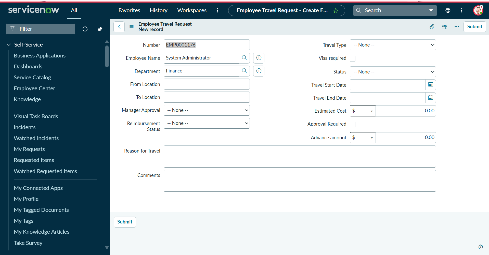
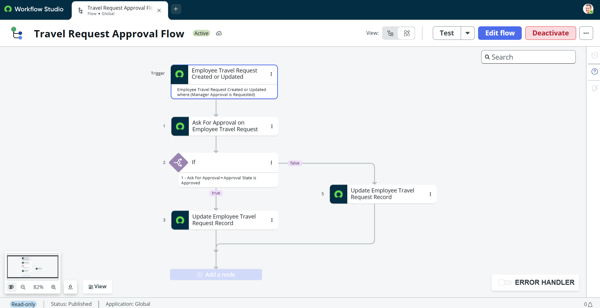
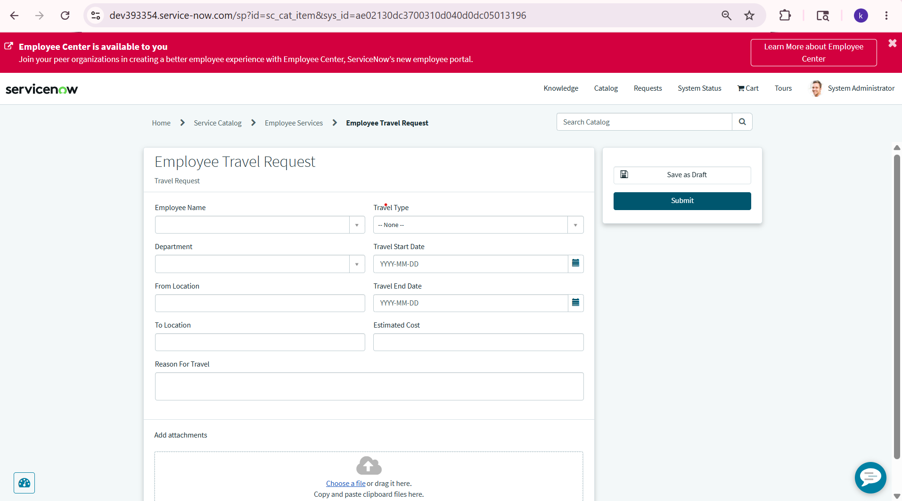

# Employee Travel Reimbursement Management System

## Overview
Developed an end-to-end Employee Travel Reimbursement Management System using ServiceNow to automate employee travel requests, manager approvals, and reimbursement workflows.

## Features
- Flow Designer approval workflows
- Dynamic manager approvals
- Business Rules automation
- Client Scripts and UI Policies
- Service Portal integration
- Automated status updates
- Approval and rejection workflows

## Technologies Used
- ServiceNow
- JavaScript
- Flow Designer
- GlideRecord
- Business Rules
- Client Scripts
- UI Policies
- Service Portal

## Screenshots

### Employee Travel Request Form

### Flow Designer Workflow

### Portal View

